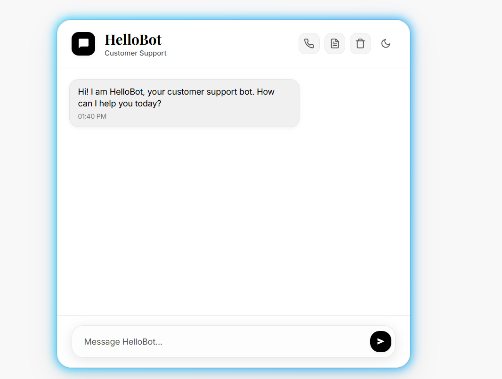
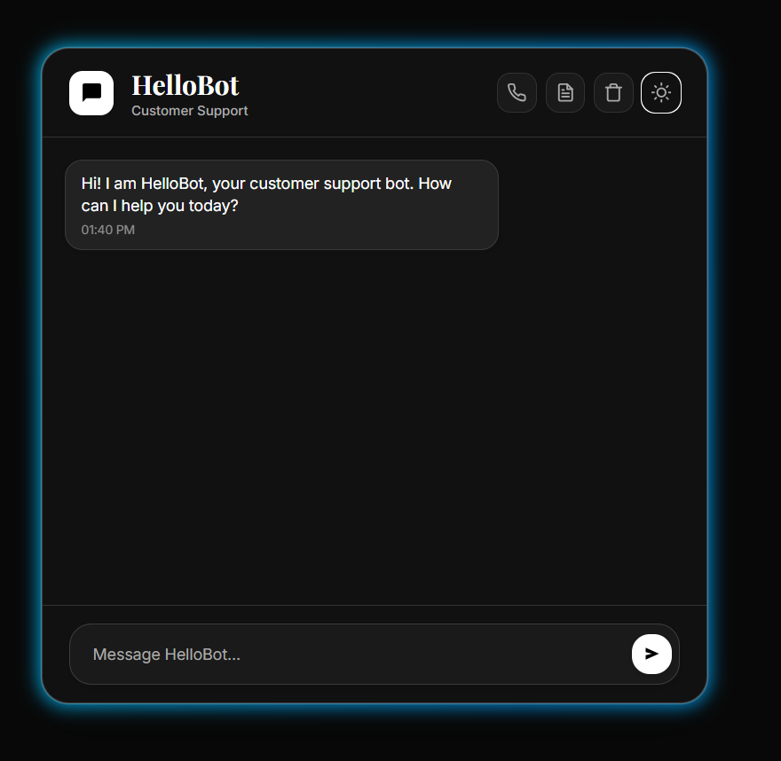
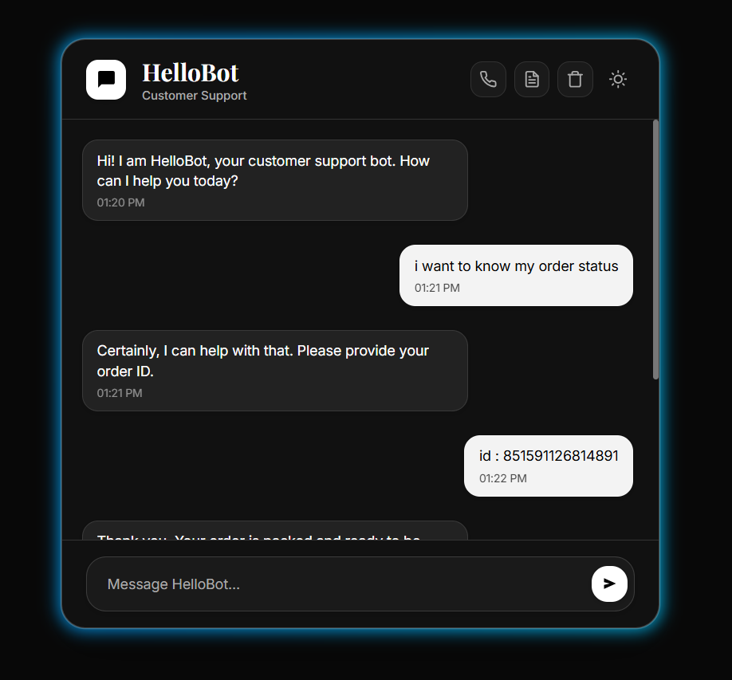
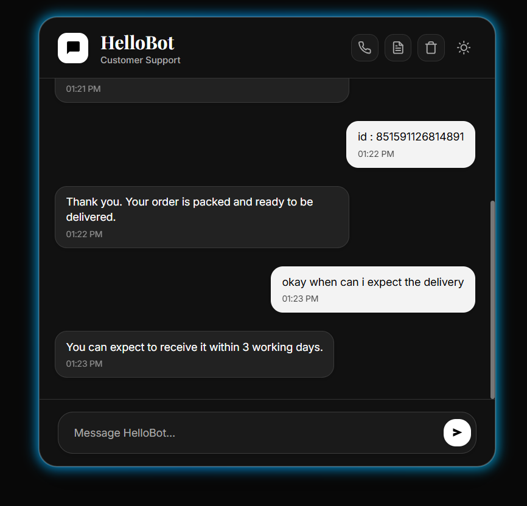

# 🧠 HelloBot: LLM-Powered Customer Support Automaton
> An advanced generative AI agent for dynamic, context-aware customer support, combining structured transactional data with general knowledge for precise and human-like responses.

**Author:** Mantra Raval  
**LinkedIn:** [https://www.linkedin.com/in/mantraraval](https://www.linkedin.com/in/mantraraval)

---

## 🚩 1. Motivation
Traditional chatbots are rigid **Finite-State Machines (FSMs)**. They struggle with ambiguous queries, cannot maintain context, and fail to perform **slot-filling**—asking for missing information—which often leads to stalled conversations and frustrated users.

HelloBot addresses these limitations by orchestrating an **LLM-driven reasoning engine with a secure Python backend**, enabling intelligent, multi-turn dialogue with dynamic slot-filling and context-aware responses.

---

## 💡 2. Architectural Overview
HelloBot is designed as a **modular, decoupled system**:

* 🤖 **LLM Reasoning Engine:** Understands intent, maintains context, and generates human-like responses.
* ⚙️ **Python Backend Orchestrator:** Securely retrieves structured and unstructured data, manages slot-filling, and executes multi-step workflows.
* 🗄️ **Dual Data Layer:**
  - **Relational Database:** Stores structured transactional data (user IDs, order status, history).  
  - **MongoDB Knowledge Layer:** Stores general company knowledge, policies, FAQs, and standard practices.

This ensures **secure, multi-turn reasoning**, separating reasoning from data retrieval while supporting accurate responses.

---

## ⚙️ 3. Key Features
* 🧠 **Multi-Turn Reasoning:** Maintains conversational context across interactions.  
* 🎯 **Dynamic Slot-Filling:** Detects missing information and queries users naturally.  
* 🔐 **Secure Data Handling:** LLM never accesses databases directly; Python handles retrieval.  
* ⚡ **Dual-Source Synthesis:** Combines structured order data and general knowledge seamlessly.  
* 🎨 **Modern UI:** React.js SPA for smooth, responsive interaction.  

---

## 💻 4. Technology Stack
The HelloBot system is built on a modern, decoupled architecture leveraging the following key technologies:

* **Backend & Orchestration:** **Python** (for core logic, LLM calls, and data retrieval), **Node.js** (for the API Gateway).
* **AI/LLM:** A **Large Language Model (LLM)** for intent recognition, context management, slot-filling, and generative response framing.
* **Frontend:** **React.js** to deliver a modern, single-page application (SPA) user interface.
* **Structured Data:** A **Relational Database** (e.g., PostgreSQL, MySQL) for transactional and secure order data.
* **Unstructured Data:** **MongoDB** for flexible storage of policies, FAQs, and general company knowledge.


---

## 🔄 5. Request Lifecycle: User Scenario
1.  **💬 Initial Query:**
    * **User:** “What is my order status?”
    * **System:** React.js client → Node.js API gateway.

2.  **🧩 Intent & Slot Analysis (LLM Pass 1):**
    * Python Service invokes LLM to analyze intent.
    * **LLM Output:** `Intent = get_order_status`, `Missing Slot = order_id`.

3.  **✍️ Dynamic Slot-Filling:**
    * Python → LLM: Generate prompt to request missing order ID.
    * **LLM → User:** “Could you please provide your order ID?”

4.  **📊 Structured Data Retrieval (Relational DB):**
    * **User:** “id-857591726814891”
    * Python queries Relational Database:
        ```sql
        SELECT status FROM orders WHERE order_id = 'id-857591726814891';
        ```
    * **DB Response:** `{ "status": "Packed" }`

5.  **📝 Generative Framing (LLM Pass 2):**
    * Python → LLM: Frame response based on order status.
    * **LLM → User:** “Your order (id-857591726814891) is packed and ready to be dispatched.”

6.  **📚 Follow-Up Query (Knowledge DB):**
    * **User:** “How much time will it take?”
    * Python → LLM: Queries MongoDB for general knowledge/policies.

7.  **✅ Final Answer (LLM Pass 3):**
    * Python → LLM: Frame final response.
    * **LLM → User:** “It will be delivered in 3 working days.”

---

## 6. Future Enhancements
This project provides a robust foundation for several advanced features:
* **Long-Term Conversational Memory:** Implementing a vector database (e.g., Pinecone, ChromaDB) to store conversation embeddings, allowing the agent to recall context from past interactions.
* **Proactive Agentic Behavior:** Granting the agent the ability to *initiate* actions, such as automatically flagging a late order for human review or offering a discount after a negative sentiment is detected.
* **Multi-Modal Input:** Expanding the interface to accept image uploads (e.g., a photo of a damaged product) for analysis.

## 7. Project Demo




